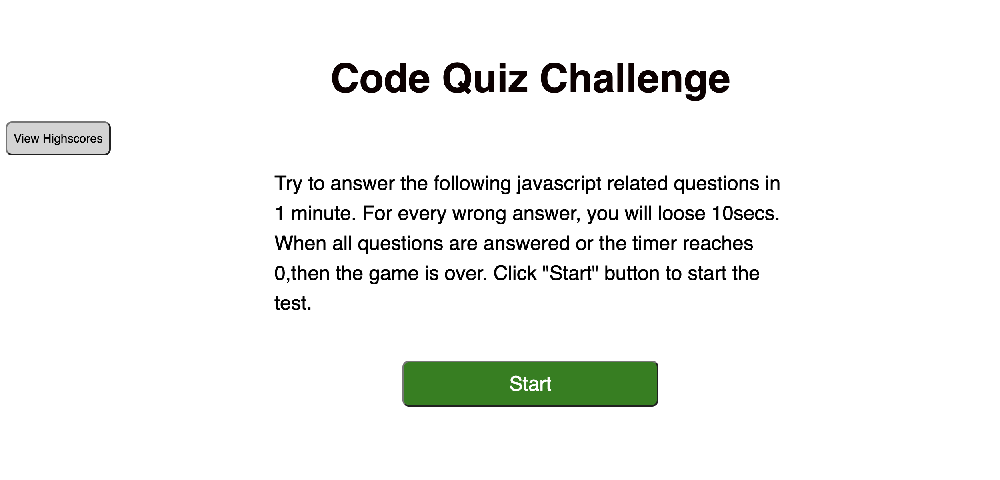
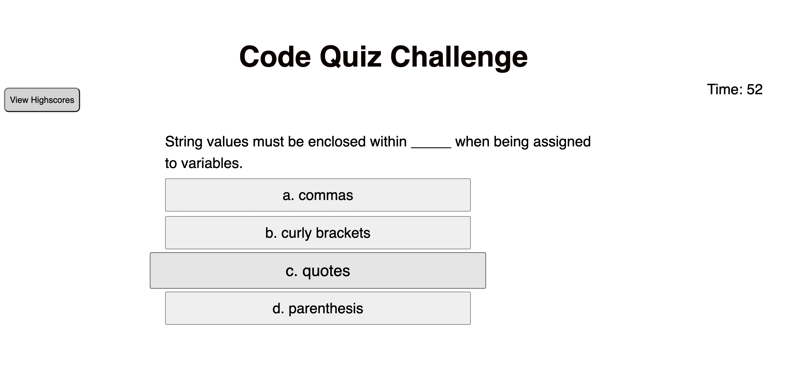
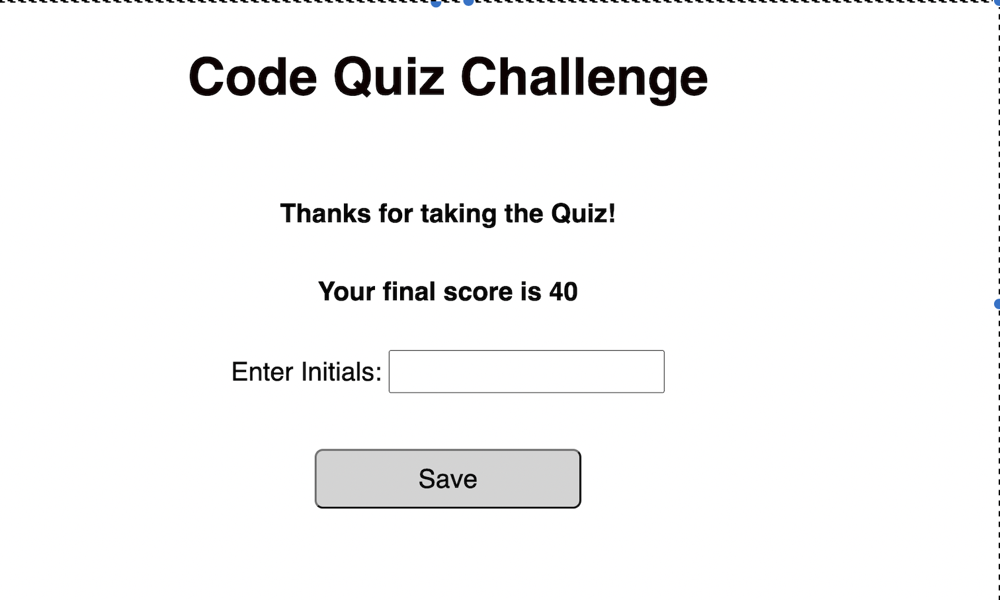

# Quiz-application

## Technology Used 

| Technology Used         | Resource URL           | 
| ------------- |:-------------:| 
| HTML    | [https://developer.mozilla.org/en-US/docs/Web/HTML](https://developer.mozilla.org/en-US/docs/Web/HTML) | 
| CSS     | [https://developer.mozilla.org/en-US/docs/Web/CSS](https://developer.mozilla.org/en-US/docs/Web/CSS)      |   
| JavaScript | [https://developer.mozilla.org/en-US/docs/Web/JavaScript](https://developer.mozilla.org/en-US/docs/Web/JavaScript) |
| Git | [https://git-scm.com/](https://git-scm.com/)     |    

 

## Description 

This application generates quiz dynamically using HTML, CSS and Javascript. The user has about 1 minute to answer all questions and looses 10secs for every wrong answer. Once timer reaches 0 or when all questions are answered, then game is over. Final scores will be displayed and can be stored on local storage for viewing later.

 Highlights of this application:
* Using an interval to track and display the remaining time
* Dynamically creating HTML elements for each question and the answer 
* Storing and retrieving scores in local storage

 

## Learning Points 

* creating dynamic html elements
* event handling
* Intervals and timeouts
* Local storage

 

## Usage 

Welcome Page

When the user clicks the "Start" button on welcome page, the timer starts and a question is displayed as shown below.

 

 

 When the quiz ends, the user is prompted to enter his/her initials in order to save his/her score:

 

 

High scores are displayed automatically after the user enters his/her initials, and the user can also view the scores at any time using the View HighScores button:

 

 

## Links

Github Repo - https://github.com/srinithi19/Quiz-application  
Application URL - 
